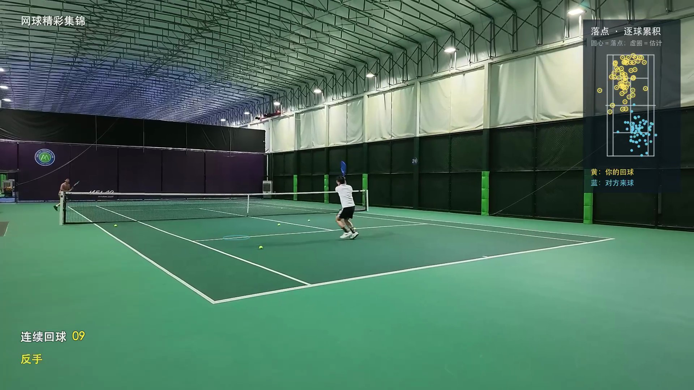

# 🎾 TennisHighlight · Tennis Highlight Editing Skill

**You hit the shot. Keep the moment.**

The forehand that finally found its mark. The rally neither player wanted to end. The ball you somehow chased down. Great moments on court deserve more than a forgotten spot in a long recording.

TennisHighlight is for people who love playing tennis and want to keep improving. Give it your raw footage and start with a single prompt: turn your best rallies into a **highlight reel under five minutes**, then bring shot statistics, ball paths, landing maps, and practice advice together in a playable HTML report.

**Something worth sharing. Something to work on next time.**

[中文](README.md) · [Highlight Video Demo](https://github.com/rubyonway/TennisHighlight/releases/download/demo-v1/tennis-highlight-v5.mp4) · [HTML Review Demo](https://github.com/rubyonway/TennisHighlight/releases/download/demo-v1/tennis-review-html-demo.zip)

## See it in action

[](https://github.com/rubyonway/TennisHighlight/releases/download/demo-v1/tennis-highlight-v5.mp4)

| Demo | What's inside | Download |
| --- | --- | --- |
| Highlight video | 4:25, seven complete rallies, 1080p, on-court audio, ball paths and landing illustrations | [MP4, about 404 MB](https://github.com/rubyonway/TennisHighlight/releases/download/demo-v1/tennis-highlight-v5.mp4) |
| HTML review report | The highlight video, 567 return records, landing maps, technique images, and practice suggestions | [Demo bundle, about 405 MB](https://github.com/rubyonway/TennisHighlight/releases/download/demo-v1/tennis-review-html-demo.zip) |

Extract the HTML bundle and open `网球训练复盘.html`. Keep the adjacent `媒体` folder in place. The bundle already includes the highlight video, so you only need this download to explore the full demo. **The three source videos are not included.** Full-footage statistics and source timestamps remain; source-video playback controls have been removed. The sample report is in Chinese.

## What it does

### 1. Give a great point the full replay it deserves

- **Find the rallies worth keeping:** Use the target player's shot quality, rally length, and clearly evidenced finishing shots to select long exchanges and standout moments.
- **Keep the whole point:** Preserve each selected rally through the dead ball, including the buildup, changes in pressure, and final shot. Meet the duration target by choosing complete rallies.
- **Keep the action in view:** Use framing keyframes, restrained tracking, and zooms informed by the ball path to make the player and key action easier to follow.
- **Make the ball path visible:** Add trails, return counts, and Hawk-Eye-style landing illustrations where the footage supports them, showing direction and depth.

### 2. Know what is working and what to practice next

- **Forehand and backhand breakdowns:** Review shot counts, outcomes, rally-continuation rates, and unknown samples across the full footage, with records behind the numbers.
- **Speed and movement references:** When camera calibration and continuous tracking support them, estimate average forehand/backhand ball speed and movement distance, with explicit coverage. Leave unsupported metrics blank.
- **Technique review:** Examine key frames and source timestamps for visible issues in preparation, footwork, contact, and follow-through.
- **Practice you can take to court:** Turn vague advice into concrete movement cues, repetitions, and drill targets for your next session.

### 3. Keep the whole review in one place

Watch highlights, browse statistics, explore landing maps, filter shot records, and read practice suggestions on one page. Click a highlight landing point to replay the moment, or download the data for further analysis. Deliveries that include source footage also support playback at source timestamps.

## Install and use

Name the skill folder `tennis-video-review` and place it in your Codex skills directory. The default location is `~/.codex/skills/tennis-video-review`.

Or clone it into a destination that does not yet exist:

```bash
git clone https://github.com/rubyonway/TennisHighlight.git ~/.codex/skills/tennis-video-review
```

Start a new session, provide the video paths, and ask:

```text
Use $tennis-video-review to edit my tennis footage, focusing on the player closest to the camera. Keep complete rallies, create a highlight reel under five minutes, summarize forehand and backhand performance across the full footage, review technique, and produce an HTML report with playable video.
```

**Bring your footage. Take home your highlights and a review you can learn from.**

See [SKILL.md](SKILL.md) for the complete workflow. This is a Codex skill with analysis and editing guidance plus statistics and preview helpers. It does not bundle a dedicated tennis recognition model. Results depend on camera placement, clarity, occlusion, and review quality.

## Be precise about the numbers

- Highlight performance does not represent the entire session. Rally-continuation rate is not a verified in-bounds rate.
- “Hawk-Eye-style” describes the visualization. Single-camera estimates do not offer professional line-calling or radar-speed accuracy.
- Unclear shots remain unknown. Landing points calibrated using a player's observations are labeled accordingly and cannot independently validate those same observations.

## Helper scripts and references

Python 3.9 or later is required. The helper scripts use only the standard library. Video work uses local FFmpeg / FFprobe as needed, without requiring a corporate network or a particular cloud service.

```bash
# Summarize shot annotations while preserving unknown outcomes
python3 scripts/summarize_events.py /path/to/events.json --output /path/to/summary.json

# Preview a local HTML report with seekable video
python3 scripts/serve_report.py /path/to/report-folder --port 8921

# Check the helper scripts
python3 scripts/check_helpers.py
```

Further details: [Data and report conventions](references/data-and-report.md) · [Video analysis and editing](references/video-analysis.md). These technical references are currently in Chinese.

Demo video and report files are available separately in [Releases](https://github.com/rubyonway/TennisHighlight/releases/tag/demo-v1). They are not required to install the skill. Personal videos and reports generated with the skill stay local by default.
